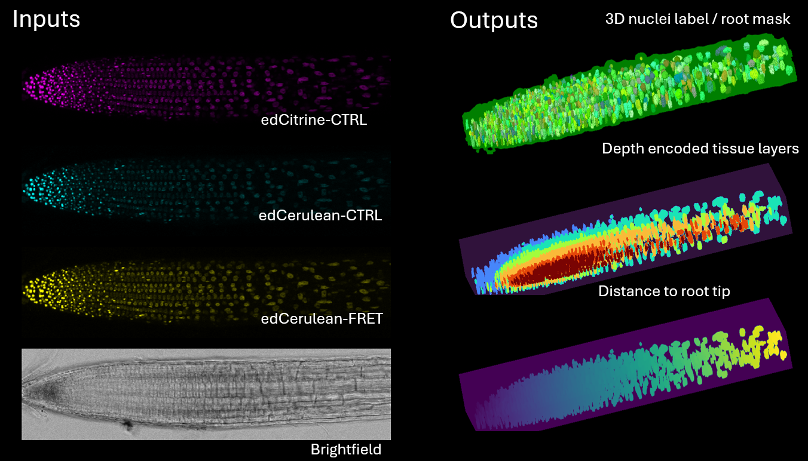
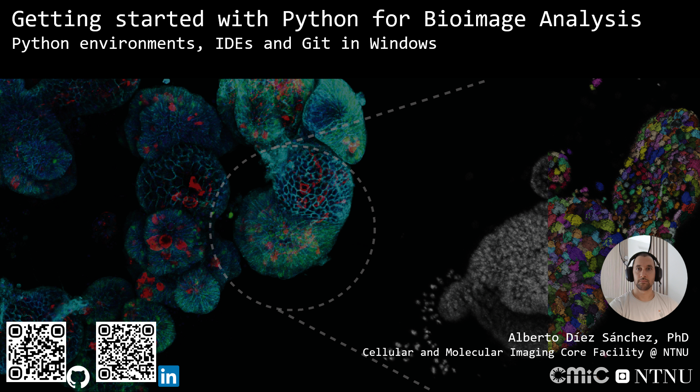

<h1>FRET-NroOT — Automatic tissue layer assignment of Arabidopsis root and FRET ratio calculation in the nuclear compartment</h1>

Analysis of Arabidopsis Thaliana roots, FRET-ratio in nuclei compartment. 3D reconstruction of root structure.

<h2>Data acquisition and file naming conventions</h2>

> [!WARNING]
> The pipeline expects image stacks to be acquired inward, starting with the first slice outside the root surface and ending inside the root, stopping at or just beyond the midline.

Please follow the naming convention below:

   <code>
   data/                                  # Primary data folder containing all .lif containers
   ├── YYYYMMDD_experiment_treatment.lif  # .lif container with metadata separated by underscore (_)
   │   ├── genotype replicateid           # 3D stack with genotype and replicate
   │   ├── genotype replicateid
   │   ├── genotype replicateid
   │   └── ...
   ├── YYYYMMDD_experiment_treatment_.lif 
   │   ├── genotype replicateid
   │   ├── genotype replicateid
   │   ├── genotype replicateid
   │   └── ...
   └── ...
   </code>

<h2>How to install this tool? (Environment setup)</h2>

> [!TIP]
> In order to run these Jupyter notebooks and .py scripts you will need to familiarize yourself with the use of Python virtual environments, IDEs and Git. If you are not familiar with those concepts worry not. Watch the [Before you start (Python, IDE and Git on Windows)](https://youtu.be/tzdFuxF2E3U) video, it will guide you through the necessary steps and cover all basic concepts.
>
> TL;DR You are busy in the wet lab, skip to the Pixi section below.

|  | Watch on YouTube | Description |
|-------|------------------|-------------|
|  | [Before you start (Python, IDE and Git on Windows)](https://youtu.be/tzdFuxF2E3U) | If you are not familiar with Python, Virtual Environments, Integrated Developer Environments (IDEs) or version control this is the place to start. In this video we will cover how to configure your Windows machine to be able to run this pipeline  |

1. Clone this repository using:

   <code>git clone https://github.com/adiezsanchez/saramorg_fret_nroot</code>

2. If you do not have git installed you can download the code as a .zip file by clicking on the green < > Code button at the upper right corner of the repo.

3. Proceed to the next step using **Pixi** as your environment manager of choice.

|  | Watch on YouTube | Description |
|-------|------------------|-------------|
|  | [Pipeline installation using Pixi](https://youtu.be/tzdFuxF2E3U) | TL;DR You are busy in the wet lab and want to get your hands on in this tool and start using it ASAP.  |

> [!TIP]
> Using [Pixi](https://pixi.sh/latest/installation/) allows to share fully reproducible environments

After installing pixi, type the following command, after it is done installing your virtual environment it will launch a Jupyter instance in your browser so you can interact with the pipelines.

<code>cd saramorg_fret_nroot && pixi run lab</code>

<h2>Workflow summary</h2>

**Notebook 0: Single LIF image (`0_SP_single_lif_image.ipynb`)**

- Loads one image from a `.lif` container, with voxel spacing from metadata for anisotropy-aware 3D CellposeSAM nuclei segmentation and optional reuse of cached labels.
- Builds a 3D root mask by combining PanSeg-style UNet3D boundary inference with nuclei constraints, then refines the mask (morphology, EDT, smoothing).
- Computes nucleus-to-root-surface depth, classifies root cap vs root body, maps depth clusters to tissue layers, and measures per-nucleus FRET-related intensities and ratios.
- Identifies a tip nucleus, computes normalized centroid distance to the tip (`distance_to_tip`), and exports Napari-friendly QC overlays.

**Notebook 1: Batch LIF containers (`1_BP_multiple_lif_containers.ipynb`)**

- Runs the same core logic headlessly over many `.lif` files using `utils.batch_processing` (same outputs as the CLI batch runner).
- Writes one CSV per image under the configured results root; includes `tip_cell`, `distance_to_tip`, and `input_img_shape` for downstream QC and 3D plotting.

**Notebook 3: Exploratory data analysis (`3_Data_analysis_exploratory.ipynb`)**

- Recursively loads per-image CSVs from a results directory, concatenates them, and supports interactive exploration (for example 3D centroid scatter plots via `plot_prop_to_3d_centroids`).

## Batch Processing CLI

Once inside the repo root activate the pixi environment using:

`pixi shell`

You can run the batch LIF processing pipeline from command line using:

`python src/run_batch_processing.py --input-dir <path_to_raw_data> --config <path_to_config_yaml>`

### Required arguments

- `--input-dir`: directory containing `.lif` containers to process.
- `--config`: YAML file with model, inference, segmentation, and batch settings.

### Example

`python src/run_batch_processing.py --input-dir C:\Users\adiez_cmic\github_repos\saramorg_fret_nroot\raw_data --config configs/batch_processing.example.yaml`

### Config template

An annotated example config is available at:

- `configs/batch_processing.example.yaml`

This file documents each supported variable and mirrors the same parameters used in the batch notebook.

## Per-image CSV outputs

Results for each image are written to `<results_root>/<lif_container_id>/<lif_image_name>.csv` (see the `results_root` block in the example YAML config). Each output CSV contains nucleus-level measurements as columns, grouped and explained below:

Tip distance and image shape are not configurable via YAML; `tip_cell`, `distance_to_tip`, and `input_img_shape` are always added when a CSV is (re)computed.

Key Output Columns:

- `lif_container_id`: Name or identifier of the original LIF file container.
- `lif_image_name`: Name of the individual image extracted from the container.
- `label`: Unique integer identifier for each nucleus object.

**Centroid/Position Columns:**
- `centroid-0`, `centroid-1`, `centroid-2`: Spatial coordinates (z, y, x) of the nucleus centroid.
- `depth`: Normalized distance of the nucleus centroid from the outer root surface, 0 = outside.
- `distance_to_tip`: Normalized distance from the nucleus centroid to the root tip cell, 0 = tip.
- `input_img_shape`: Original segmentation image shape as a JSON list `[Z, Y, X]`.

**Morphology Columns:**
- `area`: Volume of the nucleus in voxel units.
- `area_bbox`: Area of the bounding box around the nucleus.
- `area_convex`: Volume of the convex hull of the nucleus.
- `area_filled`: Volume of the filled region of the nucleus.
- `axis_major_length`: Length of the major axis of the fitted ellipse in 3D.
- `axis_minor_length`: Length of the minor axis of the fitted ellipse in 3D.
- `equivalent_diameter_area`: Diameter of a sphere with the same volume as the nucleus.
- `euler_number`: Euler number (topology feature) of the nucleus region.
- `extent`: Ratio of nucleus volume to bounding box volume.
- `feret_diameter_max`: Maximum Feret diameter of the nucleus.
- `solidity`: Ratio of the nucleus volume to its convex hull volume (shape compactness).
- `inertia_tensor_eigvals-0`, `inertia_tensor_eigvals-1`, `inertia_tensor_eigvals-2`: Eigenvalues of the inertia tensor, describing shape distribution.

**Intensity Columns:**  
_for each marker, intensity is measured within the nucleus:_
- `edCerulean_CTRL_mean_int`, `edCerulean_CTRL_min_int`, `edCerulean_CTRL_max_int`, `edCerulean_CTRL_std_int`, `edCerulean_CTRL_sum_int`
- `edCitrine_FRET_mean_int`, `edCitrine_FRET_min_int`, `edCitrine_FRET_max_int`, `edCitrine_FRET_std_int`, `edCitrine_FRET_sum_int`
- `edCitrine_CTRL_mean_int`, `edCitrine_CTRL_min_int`, `edCitrine_CTRL_max_int`, `edCitrine_CTRL_std_int`, `edCitrine_CTRL_sum_int`

**FRET Ratio Columns:**
- `FRET_ratio_sum`: Total FRET ratio per nucleus.
- `FRET_ratio_mean`: Mean FRET ratio within the nucleus.
- `FRET_ratio_sum_norm_per_image`: FRET ratio sum normalized per image.
- `FRET_ratio_mean_norm_per_image`: FRET ratio mean normalized per image.

**Tissue/Classification Columns:**
- `tip_cluster_id`: ID for the tip cluster assignment.
- `root_part`: Assignment to tip or root body.
- `depth_cluster_id`: Cluster assignment based on nucleus depth.
- `tissue_layer`: "Epi", "Cor", "End", "Per", "Vasc" for root body, "root_cap" for root cap.
- `tip_cell`: Flag (1 for tip cell nucleus; 0 otherwise).

<h2>Raw Data Download (.lif)</h2>

1. [Contact Me](mailto:alberto.d.sanchez@ntnu.no) to obtain a fresh working S3 bucket pre-signed link (when a public archive is not yet linked here).

2. Paste the link inside the data-download notebook you use for this project after <code>presigned_url</code> (if applicable).

3. Run the notebook to download and extract the data.

<h2>Bioimage Archive deposition</h2>

Placeholder for Bioimage Archive repository

<h2>Materials and Methods: Image Analysis</h2>

3D `.lif` root images were analyzed with a CellposeSAM-based nuclei segmentation workflow, voxel anisotropy correction from image metadata, and a boundary prediction UNet3D [Panseg](https://github.com/kreshuklab/panseg) pretrained model (`lightsheet_3D_unet_root_ds3x`). A rough 3D root mask was produced by combining boundary inference with nuclei label constraints, refined with morphological operations and distance transforms. Per-nucleus depth relative to the outer root surface was computed with anisotropy-aware EDT; nuclei were classified into root cap vs root body and mapped to tissue layers using depth- and intensity-informed clustering. FRET-related channels were summarized per nucleus (mean/min/max/std/sum). **FRET_ratio_sum** and **FRET_ratio_mean** use the configured DA (donor-excited acceptor) and DD (donor-excited donor) markers:

- **FRET_ratio_sum** = (Σ *I*DA) / (Σ *I*DD), with both sums taken over all voxels in the nucleus. (**NaN** if either Σ *I*DA or Σ *I*DD is ≤ 0.)

- **FRET_ratio_mean** = (mean *I*DA) / (mean *I*DD) over voxels in the nucleus (equivalently, per-voxel mean intensities in the DA and DD channels). (**NaN** if either mean *I*DA or mean *I*DD is ≤ 0.)

A tip nucleus was identified to define normalized centroid distances to the root tip. Batch outputs were consolidated into per-image CSV files for downstream concatenation and exploratory plotting. Sums and means are computed over all voxels within each nucleus.

<h2>How to cite this pipeline</h2>

If you are using this pipeline to analyze your bioimage data you can easily include it in your references following the instructions below:

- For machine-readable citation metadata, see `CITATION.cff` in this repository (also surfaced on GitHub under **About → Cite this repository**).

- When a Zenodo archive exists for this repository, APA, Harvard, MLA, Vancouver, Chicago, and IEEE styles will also be available from the Zenodo record page (add the DOI badge here after the first release is archived).

<h2>Related publications</h2>

Placeholder for publications citing this pipeline

